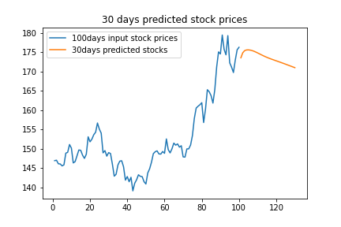

# StockPriceForecasting
A deep learning model which predicts the future value of stocks upto 30 days.

  

## Inspiration
Stock markets help companies to raise capital and generates personal wealth. The entire idea of predicting stock prices is to gain significant profits. Predicting how the stock market will perform is a hard task to do. There are other factors involved in the prediction, such as physical and psychological factors, rational and irrational behavior, and so on. All these factors combine to make share prices dynamic and volatile. This makes it very difficult to predict stock prices with high accuracy. 

## Overview
Data is extracted using `tiingo api` of AAPL and is saved in 'AAPL1.csv'. I used the Close column to train my model.The Close column refers to the price of an individual stock when the stock exchange closed the market for the day. Data is splited using the date column and is trained using LSTM. The model taked 100 days of input and predicts the stock of next day.

